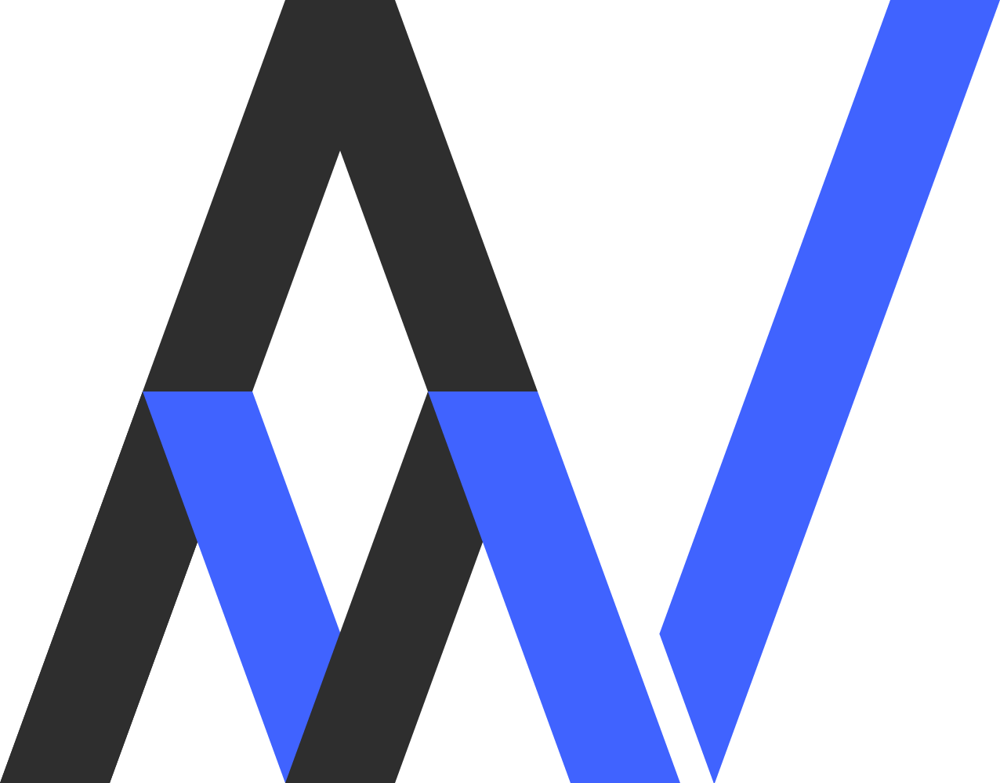

# AVM Consultancy

  

## Information about The Website

This website is a portfolio for AVM Consultancy, an engineering consultancy in the telecoms Industry.  This is the 3rd website I have made for a client, so this README lists some useful information about building the site, including the technologies and resources I used and any other details about the process that I might find useful in the future.

### File Structure

* index.html
* css
    * about-page.css
    * contact-page.css
    * footer-page.css
    * index.css
    * landing-page.css
    * navigation.css
    * normalize.css
* scss
    * about-page.scss
    * contact-page.scss
    * footer.scss
    * landing-page.scss
    * navigation.scss
    * settings.scss
* media
    * photos for the website, including backgrounds, slideshow images and logos

### Technologies Used

**Normalize css:**
This css reset is useful as it follows the css specification and forces the browser to behave as expected, removing margins and resetting other styles that different browsers implement differently to how the specification states.  A great video on css resets can be found [here](https://www.youtube.com/watch?v=L4wPV-K1lNI).
[Normalize css](https://necolas.github.io/normalize.css/)

**Intersection Observer:**
I used an intersection observer within this website to create the navigation animation.  It's more performant than other ways of creating this sort of animation, and it taught me a lot about JavasSript.
[Intersection Observer Tutorial](https://www.youtube.com/watch?v=RxnV9Xcw914)
